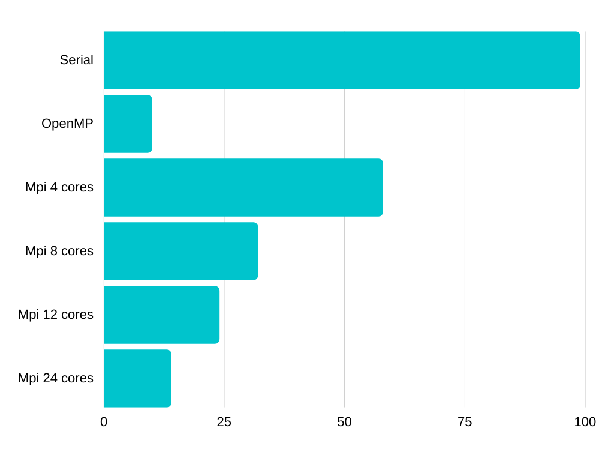

# Gaussian blur
 
In image processing, a Gaussian blur (also known as Gaussian smoothing) is the result of blurring an image by a Gaussian function (named after mathematician and scientist Carl Friedrich Gauss).

The Gaussian blur is a type of image-blurring filter that uses a Gaussian function for calculating the transformation to apply to each pixel in the image. The formula of a Gaussian function in one dimension is

## Formula

# Results

## Running with an image of <b>size 40 mb on 24 core CPU</b> for the gaussian blur with radius 10 we got the following results:

| Attempt | Serial | OpenMP  | Mpi 4 cores | Mpi 8 cores | Mpi 12 cores | Mpi 24 cores |  
| :-----: | :----: | :-----: | :---------: | :---------: | :----------: | :----------: |
| Seconds | 99     |   10    |          58 |          32 |           24 |          14  |

# Image transformation

## Input 

## Output

